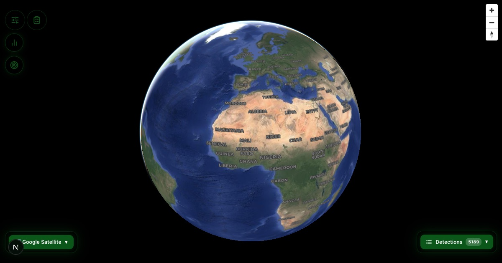

# EcoHealth Detection Map



**Live operational satellite monitoring of illegal mining (galamsey) activity in the Republic of Ghana.**

The EcoHealth Detection Map is the public monitoring interface of the EcoHealth platform. It publishes the output of an automated, weekly satellite-detection pipeline: every confirmed detection is displayed with its GPS coordinates, confidence score, and detection date, on an interactive satellite map that any government agency, non-governmental organization, journalist, researcher, or community member can access free of charge.

| | |
|---|---|
| **Application** | [app.ecohealthgh.com](https://app.ecohealthgh.com) |
| **Organization** | [ecohealthgh.com](https://ecohealthgh.com) |
| **Coverage** | Ghana — south-western mining belt, expanding nationwide |
| **Update cadence** | Automated weekly scan (every Monday), plus on-demand scans |
| **Current scale** | 5,000+ detected sites |
| **Cost of access** | Free |

---

## 1. Purpose

Enforcement against illegal mining has historically been reactive: intervention begins only after environmental damage — deforestation, river siltation, mercury contamination — is already visible on the ground. EcoHealth exists to reverse that sequence. By scanning the country from orbit every week and flagging new mining activity within days of ground-breaking, the platform gives institutions the information required to intervene early, verify precisely, and monitor whether cleared sites remain closed.

This repository contains the web application that presents those detections to the public and to institutional users.

## 2. Capabilities

### 2.1 Live detection map
- Interactive globe and satellite map (MapLibre GL) of all current detections
- Each site displays coordinates, model confidence, detection date, and region
- Detections are classified by confidence band: Critical (>90%), High (70–90%), Medium (50–70%)
- Filter by minimum confidence; toggle detection overlays; switch basemaps (Esri / Google)
- Reverse-geocoded location naming for every selected site

### 2.2 Historical imagery comparison
- Side-by-side slider comparing current satellite imagery against any year from 2016 to the present
- Historical layers are served per-year from Esri World Imagery Wayback (sub-meter resolution), selected release-by-release for maximum change visibility between years
- Camera-synchronized dual-map rendering with per-year imagery version disclosure

### 2.3 Custom detection requests
- Any user may request an on-demand scan of a specific town or area in Ghana
- Requests trigger the full detection pipeline automatically (GitHub Actions + Google Earth Engine + CNN inference) and typically complete within 15–45 minutes
- Results are delivered as an unlisted report page, with notification by email, SMS, or both, at the requester's choice
- Report pages expire automatically after 7 days

## 3. Methodology and Data Sources

| Component | Detail |
|---|---|
| Primary imagery | ESA Copernicus Sentinel-2 (harmonized surface reflectance), 10 m/pixel, 5-day revisit |
| Detection model | Convolutional neural network (ResNet-18 architecture), trained from scratch on thousands of labeled Ghanaian mining sites |
| Reported accuracy | Approximately 90% on the southern forest belt; active retraining under way for northern savanna terrain |
| Detection cadence | Full-region scan every Monday via automated pipeline; on-demand scans for requested areas |
| Historical basemaps | Esri World Imagery Wayback (© Esri, Maxar), per-year releases 2016–present |
| Current basemaps | Esri World Imagery, Google Satellite; place labels © OpenStreetMap contributors, © CARTO |

### Known limitations

Users in an enforcement or policy context should note:

1. **Model confidence is probabilistic, not conclusive.** A detection is an indicator warranting verification — by imagery review, the built-in year comparison, or ground/aerial inspection — before enforcement action.
2. **Terrain bias.** The model was trained predominantly on southern forest-belt imagery. Naturally exposed soil in northern savanna terrain can produce false positives; a northern retraining program is in progress.
3. **Legal status is not determined.** The platform detects mining activity; it does not distinguish licensed small-scale operations from illegal ones. Integration of a current government concession registry is a stated goal and open request.
4. **Historical imagery cadence.** Commercial imagery providers refresh a given area every one to three years; consecutive year layers may therefore display the same underlying capture. The imagery version date is disclosed in the interface.

## 4. System Architecture

```
ESA Sentinel-2 ──► Google Earth Engine ──► CNN inference (GitHub Actions, weekly + on-demand)
                                                    │
                                                    ▼
                              Detection data (GeoJSON, versioned in repository)
                                                    │
              ┌─────────────────────────────────────┼───────────────────────┐
              ▼                                     ▼                       ▼
   This web application            Tile/report server (Railway)      Email (Resend) /
   (Vercel, Next.js)               historical tiles, reports,        SMS (Moolre)
                                   request intake                    notifications
```

## 5. Privacy and Data Handling

- Contact details submitted with a detection request (name, email, phone) are used solely to deliver the requested report and are not shared with third parties.
- Report pages are unlisted, excluded from search-engine indexing, and automatically deleted after 7 days.
- The application sets no advertising or cross-site tracking cookies.

## 6. Device Support

The application is designed for desktop, laptop, and tablet displays (minimum width 768 px). On smaller screens, users are directed to the informational site, as the map, comparison tools, and data panels cannot be presented responsibly at phone dimensions.

## 7. Technology

| Layer | Technology |
|---|---|
| Framework | Next.js (App Router), TypeScript |
| Mapping | MapLibre GL JS (globe projection, raster and vector layers) |
| Styling | Tailwind CSS |
| Hosting | Vercel (application), Railway (tile/report server) |
| Detection pipeline | Python, TensorFlow/Keras, Google Earth Engine, GitHub Actions |

## 8. Local Development

```bash
git clone https://github.com/angeloasante/mining-frontend.git
cd mining-frontend
npm install
npm run dev
```

Environment variables (`.env.local`):

| Variable | Purpose |
|---|---|
| `NEXT_PUBLIC_TILE_SERVER_URL` | Tile/report server origin (local development: `http://localhost:5001`) |
| `NEXT_PUBLIC_SITE_URL` | Production origin for SEO metadata (default `https://app.ecohealthgh.com`) |

## 9. Roadmap

- **Nationwide model coverage** — labeled northern-terrain dataset and model retraining
- **Drone verification (V2)** — stations at detection hotspots providing photographic evidence packages to authorities
- **Concession registry integration** — automatic exclusion of licensed operations, pending provision of current registry data
- **Sustained-presence policy** — advocacy for long-term enforcement posting at cleared sites

## 10. Acknowledgements

Sentinel-2 data: European Space Agency, Copernicus programme. Historical imagery: Esri, Maxar (World Imagery Wayback). Basemaps: Esri, Google, OpenStreetMap contributors, CARTO. Earth imagery: NASA.

## 11. License and Contact

Released under the MIT License (see `LICENSE`).

**EcoHealth** — [ecohealthgh.com](https://ecohealthgh.com)
Founder and lead developer: **Angelo Asante** — [angeloasante.com](https://angeloasante.com) · [LinkedIn](https://www.linkedin.com/in/angeloasante/) · [X](https://x.com/mr_moore1776)

For institutional partnerships, data access, or the provision of licensing registry data, contact [angeloasante958@gmail.com](mailto:angeloasante958@gmail.com).
